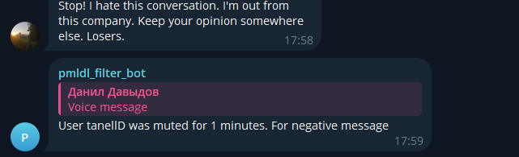

# Filter_ChatBot

Our project aims to provide useful tool for chats and groups to filter negative messages and spam.

**What to do to use our tool:**
- Clone the repo
- Get TelegramBot api key and paste it in dockerfile in code/development/Dockerfile: https://t.me/BotFather
- Download FFMPEG onto your machine
- Install the dependencies:
   - pip install -r requirements.txt
- You may run servers independently (you need to specify env variables similar to those in Dockerfiles):

   - python code/deployment/bot/bot.py

   - flask --app code/deployment/api/api run
- or using docker from project root (be aware that you need to fill bot token inside the dockerfile):
   - sudo docker-compose --project-directory ./ -f code/deployment/compose.yaml build
   - sudo docker-compose --project-directory ./ -f code/deployment/compose.yaml up

**How it looks**

Spam detection dataset: https://www.kaggle.com/datasets/uciml/sms-spam-collection-dataset

Negative messages dataset: https://www.kaggle.com/datasets/kazanova/sentiment140/data
